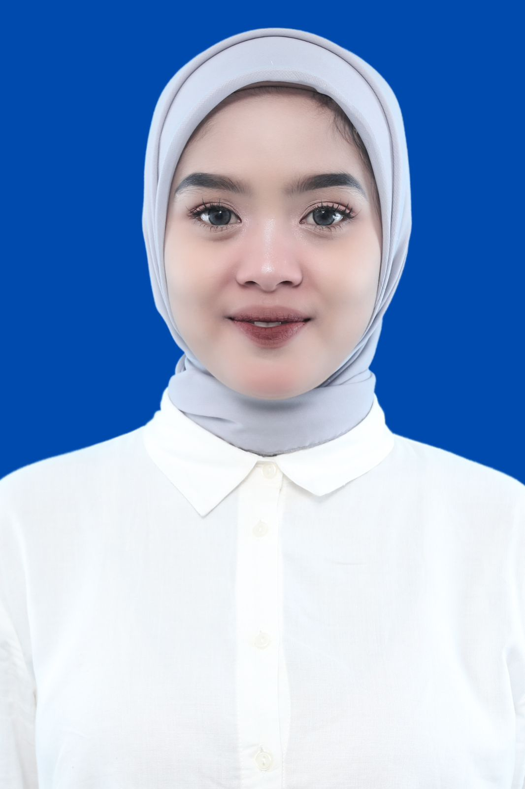
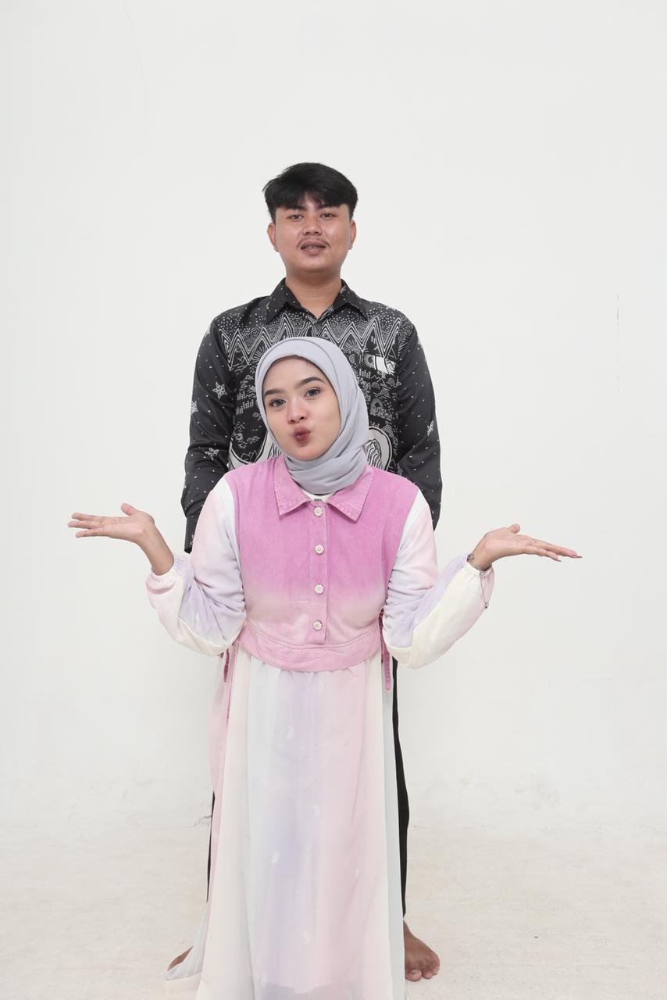
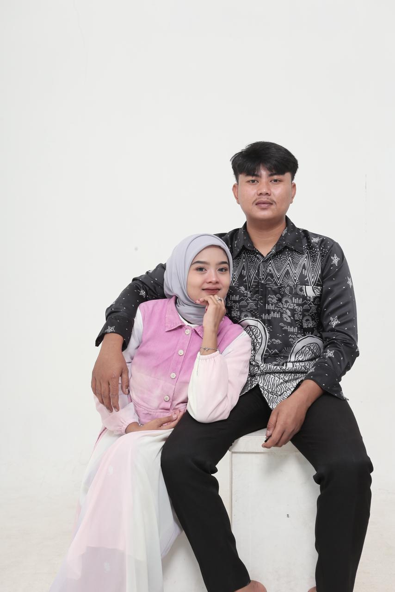

<!DOCTYPE html>
<html lang="id">
<head>
<meta charset="UTF-8">
<meta name="viewport" content="width=device-width, initial-scale=1.0">
<title>Undangan Pernikahan</title>
<link href="https://fonts.googleapis.com/css2?family=Great+Vibes&family=Playfair+Display:wght@500;700&display=swap" rel="stylesheet">

</head>

<body>

<link href="https://fonts.googleapis.com/css2?family=Great+Vibes&family=Playfair+Display:wght@600;700&display=swap" rel="stylesheet">
<!-- COVER -->

    

<h2 class="wedding-title">A Journey of Love Begins</h2>
<h1 class="nama-cover">Davi & Saniah</h1>    

    

        
Kepada Yth.

        
Bapak/Ibu/Saudara/i

        
Tamu Undangan

        <button onclick="bukaUndangan()">Open Invitation</button>
    

<!-- CONTENT -->

    <!-- KATA KATA -->
    

<h2 class="section-title">The Wedding Of</h2>    

        

<h5 class="nama-love">Davi & Saniah</h5>        

            "Dan di antara tanda-tanda kebesaran-Nya, 
            Dia menciptakan pasangan hidup agar kamu menemukan ketenangan di dalamnya, 
            serta menjadikan cinta dan kasih sayang di antara kalian."
        

        <h4>QS. Ar-Rum: 21</h4>
    

    

        

            
            <h3>Davi</h3>
            
Putra dari

            
Bapak Uus Lustiawan & Ibu Nunung Nurhayati

        

         

            
            <h3>Saniah</h3>
            
Putri dari

            
Bapak Aris & Ibu Kelly Aprilla

        

    

    <!-- GALERI -->
    

    

    

        
        
        
        

    

    <!-- MODAL ZOOM -->
    

        
    

    <!-- MASUKKAN DI BAWAH BAGIAN ACARA -->

    <!-- LOKASI -->
   <!-- LOKASI STYLE ELEGAN -->
    

        <h2 class="lokasi-title">Lokasi Acara</h2>

      <iframe
        src="https://www.google.com/maps?q=Bitung+Sari+Ciawi+Bogor&output=embed"
        width="100%"
        height="220"
        style="border:3px solid #8b0000; border-radius:18px;"
        allowfullscreen=""
        loading="lazy">
        </iframe>

        <!-- TOMBOL LINK ASLI -->
        <a href="https://maps.app.goo.gl/Na9yKscP5cigKwJb9" target="_blank">
            <button class="lokasi-btn">Buka Google Maps</button>
        </a>

        

            Jl. Mayjen He Sukma 
            Ds. Bitung Sari Kp. Bitung Ratna rt01/02 Kec. Ciawi Kab. Bogor 
            Jawa Barat 16720
        

    

    <!-- HADIAH -->
   
    <!-- HADIAH PERNIKAHAN -->
<!-- GANTI BAGIAN HADIAH LAMA DENGAN INI -->

    <h2 class="hadiah-title">Hadiah Pernikahan</h2>

    

        Doa dan Restu Anda sangat berarti bagi kami. 
        Namun, jika memberi adalah cara Anda 
        mengungkapkan kasih sayang, kami akan 
        menerimanya dengan senang hati, karena itu 
        akan menambah kebahagiaan kami.
    

    

        
<b>BCA</b>

        
6821846801

        
a.n Davi

    

    

        
<b>BCA</b>

        
6821989393

        
a.n Saniah

    

   
    <!-- COUNTDOWN -->
    

        <h2 class="title">Date</h2>

        

            

                
00

                
Day

            

            

                
00

                
Hour

            

            

                
00

                
Minute

            

            

                
00

                
Second

            

        

        <button>Save the Date</button>
    

    <!-- ACARA -->
   <!-- GANTI BAGIAN ACARA LAMA DENGAN INI -->

    

        <h2 class="acara-title">Save The Date</h2>

        

            📅
            
Minggu, 31 Mei 2026

        

        

            ⏰
            
09.00 WIB - Selesai

        

        

            📍
            
Kp. Bitung Ratna Rt01/02 (samping RA-ALIF)

        

        <button class="acara-btn">Kami Menanti Kehadiran Anda</button>

    

    <!-- UCAPAN -->
    

        <h3>💌 Ucapan</h3>
        <input type="text" placeholder="Nama">
        <textarea placeholder="Tulis ucapan..."></textarea>
        <button>Kirim</button>
    

    <!-- TAMBAHKAN DI PALING BAWAH SEBELUM 
 CONTENT -->

  

    
❀ ✦ ❀

    <h2 class="penutup-title">Terima Kasih</h2>

    

        Merupakan suatu kehormatan dan kebahagiaan bagi kami
        apabila Bapak/Ibu/Saudara/i berkenan hadir untuk
        memberikan doa restu pada hari bahagia kami.
    

    

        Kehadiran dan doa Anda adalah hadiah terindah bagi kami ✨
    

    

    <h3 class="penutup-nama">Davi & Saniah</h3>

    <!-- AUDIO -->
    <audio id="musik" loop>
        <source src="tiara.mp3" type="audio/mpeg">
    </audio>

    <!-- BUTTON MUSIK -->
    

        ▶️
    

</body>
</html>
